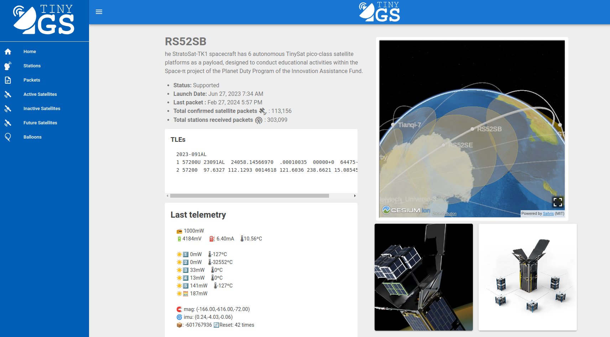
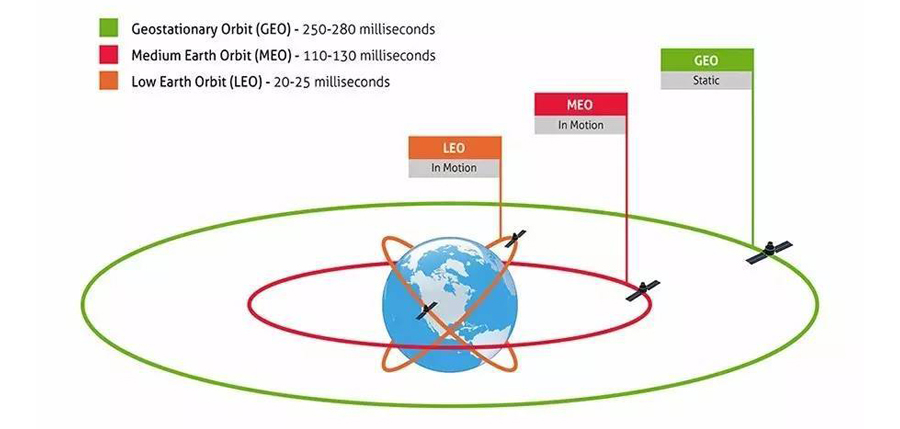
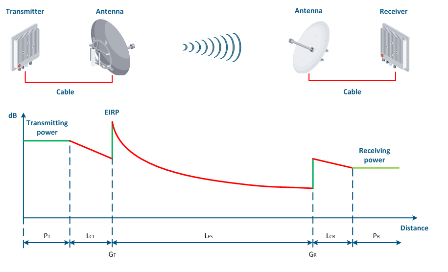
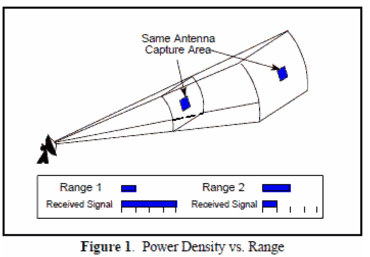
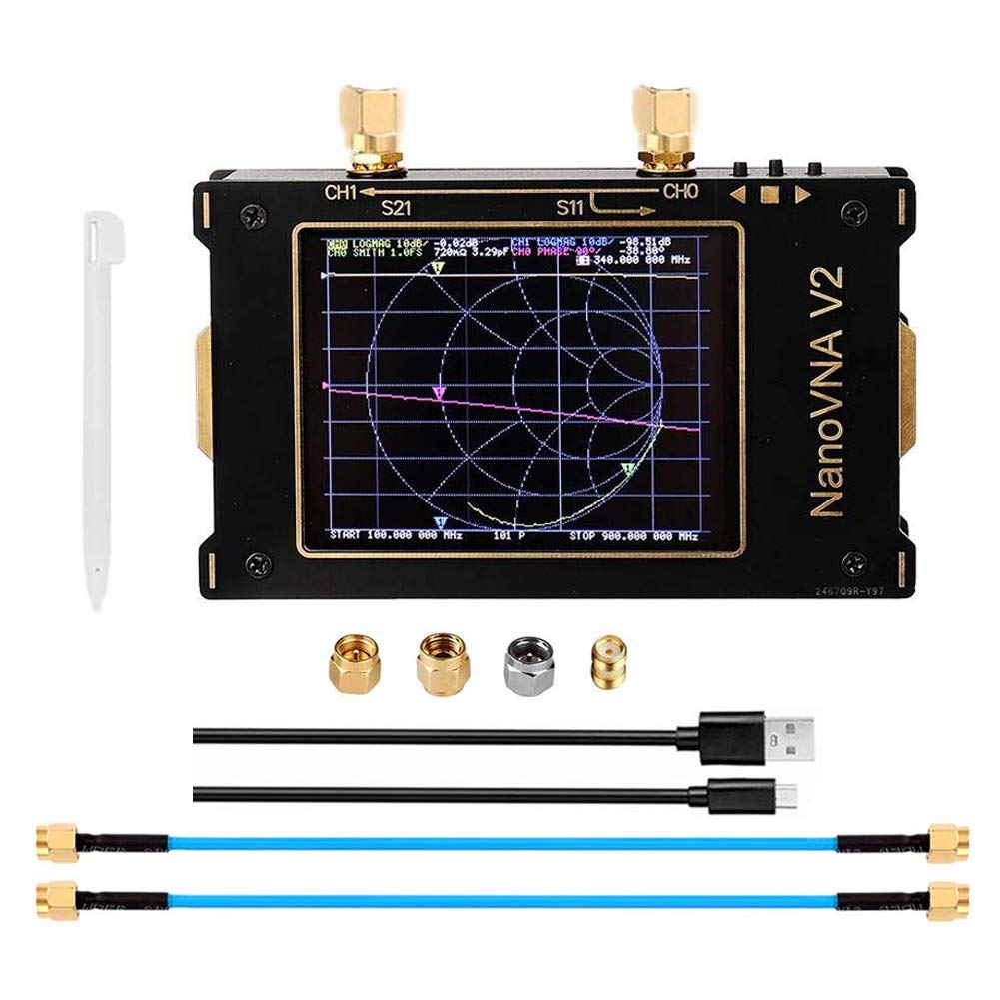
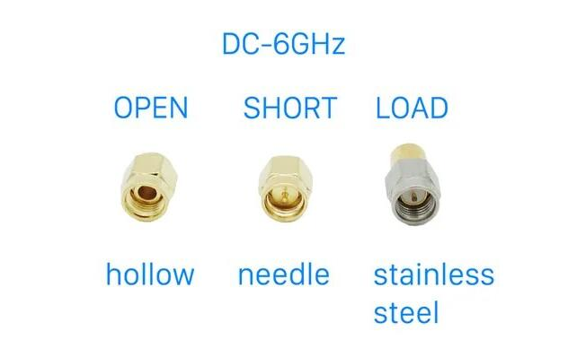

# TinyGS Lab

Estimated Completion Time: 15 minutes

In this lab you will:
- learn how to troubleshoot antennas and other RF hardware
- learn about link budget analysis
- experiment with an awesome open source repository to receive communications from tiny satellites

## What is TinyGS?

"TinyGS is an open network of Ground Stations distributed around the world to receive and operate LoRa satellites, weather probes and other flying objects, using cheap and versatile modules." ([ref 1](#references)). If you haven't done the [Meshtastic Lab](https://github.com/irongiant33/meshtastic-lab) yet to learn more about LoRa ([ref 3](#references)), the basic overview is that long range (LoRa) uses chirp spread spectrum (CSS) modulation to encode data, an advantage of CSS is that it reduces power consumption and increases the range at which data can be received, but the disadvantage is the data rates are not very high.

There is an example of a Tiny Ground Station (TinyGS) in front of you today, but let's understand more about the nodes in the TinyGS that are sending out the information - the satellites, weather probes, and other flying objects. Most of the nodes are satellites, a full listing of the active, inactive, and future satellites can be found on TinyGS's home page ([ref 1](#references)). 

 

The pictures above show the TinyGS interface for one of the active satellites, as of FEB2024, RS52SB as it is traveling towards Australia after passing over Antartica. RS52B will orbit the Earth roughly every 90 minutes because it is in low Earth orbit (LEO). The typical satellite orbits are shown in the second picture above. These orbits have high implications on RF propagation. The further out in the orbit, electromagnetic wave take longer to travel round trip from Earth. Furthermore, we'll need more complex equipment with a combination of directional and high power to reach that far. The benefit of LEO is that power and directionality are not much of a problem, but that comes at the cost of a reduced communication time window with our satellite. Passes only last a couple of minutes!

To solve this problem, companies like Starlink employ satellite constellations to guarantee that at least one satellite is orbiting overhead. TinyGS nodes do not work in a cooperative fashion; each nodes communication is independent of all other nodes. However, as a user, there is typically always at least one TinyGS satellite orbiting overhead to receive telemetry from.

  

The first picture displays a visual representation of the link budget. In essence, the link budget is a calculation of how much RF power will be at the receiver. This calculation provides an estimate for the likelihood that the transmitted signal will be effectively received. A link budget analysis is analagous to figuring out whether you have enough gas in your car to make it to your destination. 

As the above diagram shows, there is significant power reduction between the transmitter and receiver. A common misconception is that this power is lost; however, a better mental model to picture is the second diagram shown. Rather than power lost, you can imagine the power spreading the further it is away from the antenna. This spreading is proportional to the distance from the antenna squared (for those savvy math whizzes out there, this is an area measurement) so distance heavily affects received power.

The benefit of LoRa is that the link budget is close to 140 dB! This provides more than enough budget for a satellite to transmit from space and have a low-cost device be able to detect this signal on Earth's surface.

One last note on TinyGS is that its communications are only one-way. Satellites beam down their telemetry to Earth where it is received by our TinyGS's.

## Hardware

### NanoVNA

While you can interact with the TinyGS web page via desktop and mobile browser, this lab is actually using TinyGS as a lens from which to study link budget analysis and antenna troubleshooting. 

To troubleshoot antennas and other RF components, you will need a vector network analyzer. Vector network analyzers can get very expensive, but in front of you is the NanoVNA v2 which runs for close to $140 on Nooelec ([ref 4](#references)).

 

The first picture is the NanoVNA v2, and the second picture is a zoomed in version of the connectors. These will be important in the [usage](#usage) section! Short Open Load Thru (SOLT) calibration is a necessary step to measure key characteristics about your RF components. Think about it like zeroing your M4 before qualifying. SOLT calibration improves the quality of your measurement results.

What is important to measure? It depends on what exactly we are measuring. VNAs can grade the quality of antennas, amplifiers, filters, coaxial cables, crystals, and more! Today, we will just focus on antennas to keep things simple. Our NanoVNA will help us answer the question: "Is this a good antenna?"

### TinyGS and Antennas

The second piece of hardware in front of you is the TinyGS itself as well as 3 antenna options. Which should you use to increase your chances at receiving data from a satellite? If you don't know, proceed to the [usage](#usage) section now.

As you might be able to tell, one of the antennas is homemade. Alternatively, you can buy them on Amazon ([ref 6](#references)) but I thought it would've been much more fun, and a little cheaper, to just make one! I followed the guides in references 7 and 8.

## Usage

By the end of this section, we will determine which antenna is best suited for our TinyGS application. After browsing TinyGS's web page, we notice that most of the satellites operate on either 400 MHz +/-1 MHz, as well as 433 MHz +/-1MHz. Let's pick an antenna with good performance at 400 MHz.

1. Pick up the NanoVNA v2 and turn it on via the switch on the side of the device. Please use the provided mechanical pencil for all touch menu interactions and **BE GENTLE**. 
2. First, we must select which frequency range we are going to test. Select the menu and choose a frequency range 300 MHz to 500 MHz. You can increase the number of points from 101 to 201. 
3. Now that we have our range selected, we must conduct SOLT calibration as described in the [hardware](#hardware) section. If you don't know which connectors are open, short, and load go back and read that section! 
4. Proceed with SOLT calibration. Connect the short connector  to port 1and select the menu option for "short". Wait for the menu to un-highlight. Disconnect the short connector and safely store it.
5. Connect the open connector to port 1 and repeat the process. Disconnect the open connector and safely store it.
6. Finally, connect the load connector to port 1 and repeat the process. Disconect the load connector and safely store it. Congratulations, you've completed calibration!
7. Connect your first antenna to port 1. The NanoVNA will automatically measure the antenna. What do all the lines mean?
8. The first plot we are looking at is a Smith Chart. See [ref 5](#references) if you want to learn the nitty gritty details of the Smith Chart - for our purposes, you can think of a Smith Chart like a target for target practice. The center is a "bullseye" and is what we strive for. Anything further away from the center is less optimal and can cause damage to RF circuits at higher power.
9. Using the buttons at the bottom of the NanoVNA, move the marker as close to the bullseye as you can. What frequency are you reading?
10. We are now going to view a SWR chart to have another measure of performance. A SWR chart tells us the standing wave ratio (SWR) - i.e. how much of our energy goes from our device into the antenna and out into the air versus how much energy reflects and heads back to our device. In essence, an antenna is a lens that focuses electric energy into electromagnetic energy and we want to focus our lens as best we can at the frequency we wish to target. A good SWR is less than 2, and a SWR of 1 is perfect.
11. Select the SWR chart option and deselect the Smith Chart. The NanoVNA will automatically measure the antenna again. The marker will remain at the same frequency as you set it before. What is the SWR at the frequency?
12. Repeat steps 8-11 for all 3 antennas. Which performs the best for TinyGS?

## References

1. [TinyGS Home Page](https://tinygs.com/)
2. [TinyGS GitHub](https://github.com/G4lile0/tinyGS)
3. Meshtastic Lab - learn more about LoRa and yet another application of this technology: https://github.com/irongiant33/meshtastic-lab
4. [NanoVNA v2 from Nooelec](https://www.nooelec.com/store/nanovna-v2.html)
5. [Introduction to Smith Charts](https://www.antenna-theory.com/tutorial/smith/chart.php)
6. Quarter Wave Ground Plane Antenna (https://www.amazon.com/gp/product/B086YV2QLS/)
7. Quarter Wave Ground Plane Antenna calculator (https://m0ukd.com/calculators/quarter-wave-ground-plane-antenna-calculator/)
8. Andreass Spiess - Building Antennas (https://youtu.be/6cVYsHCLKq8?si=yRtoUs8RdKqU--Ev)